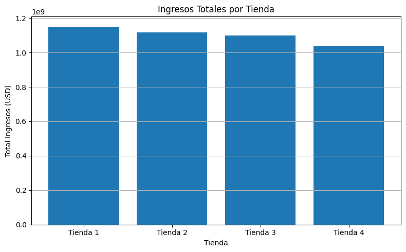
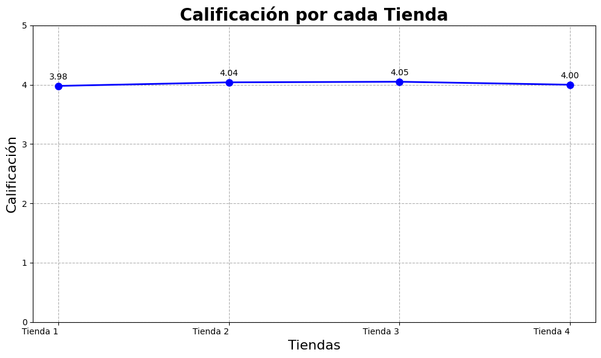
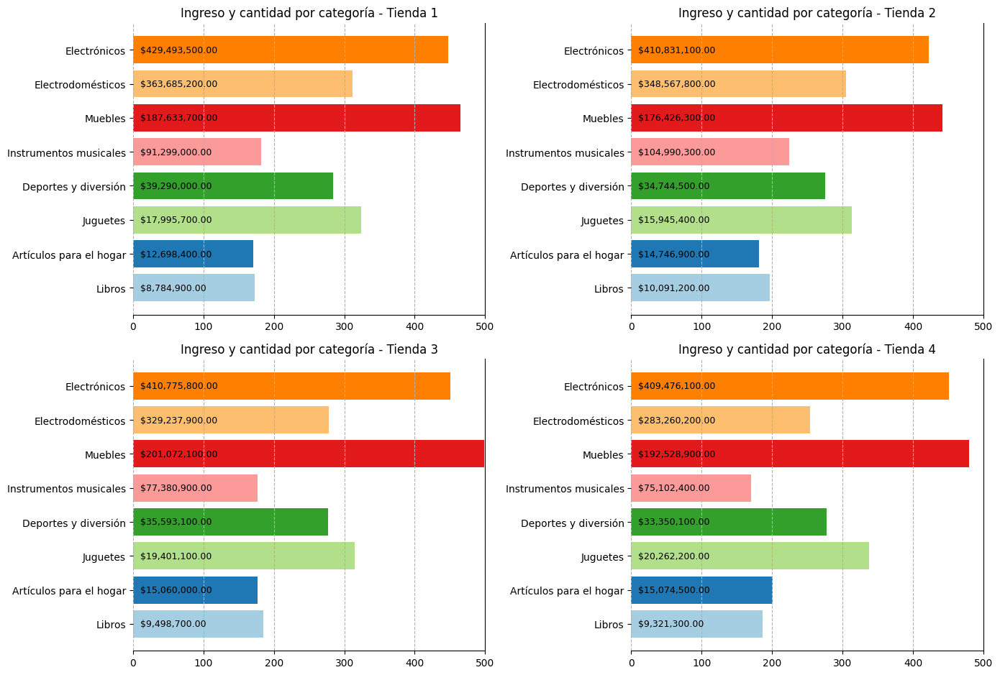
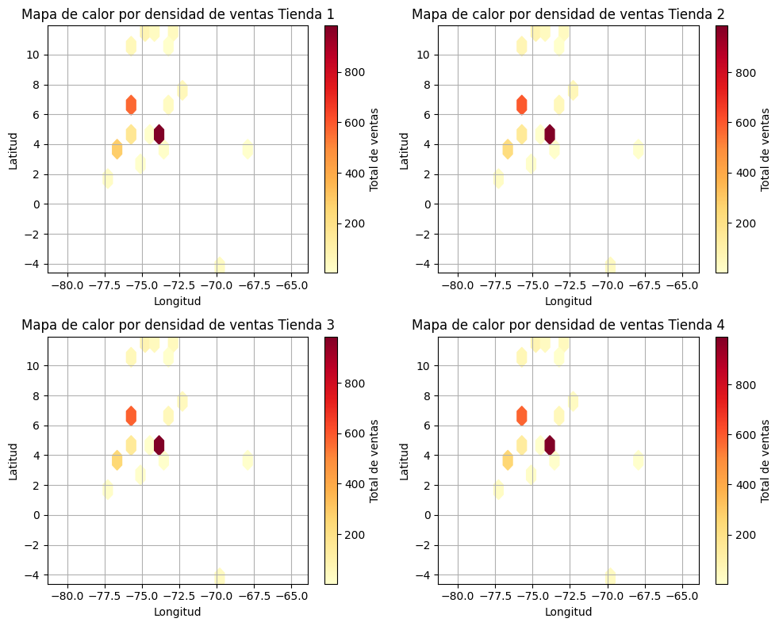

# INFORME FINAL - TIENDA A VENDER EN BASE A LOS DATOS

### Objetivo
El Sr. Juan necesita decidir qué tienda de su cadena Alura Store debe vender para iniciar un nuevo emprendimiento. Para ello, analizamos datos de ventas, rendimiento y reseñas de las 4 tiendas de Alura Store. El objetivo es identificar la tienda menos eficiente y presentar una recomendación final basada en los datos.

### Desarrollo
1. Obteniendo y comparando los ingresos total de cada tienda. Como se pude observar en la grafica, la tienda con menores ingresos en la tienda numero 4 con un total de $1038375700.0 de ingresos dado un porcentaje de 23.6 % en base a el 100% de ingresos

    

2. Tomando en cuenta la calificación promedio de las tiendas podemos observar que incluso su calificación no se encuentra muy por encima de la tienda numero uno que representa la tienda con la calificación un poco mas baja. Asi que este factor puede no ser tan importante en este caso.

    

3. En la siguientes gráficas podemos observar la cantidad de ingresos que genera cada categoría por tienda. Analizando estos datos podemos observar que existen categorías como Muebles, Artículos para el hogar y juguetes que son un poco mas demandadas en la tienda 4 en comparación en las tiendas 1 y 2.
---
<strong>Opinion 2</strong>
---

> *Tomando esto en cuenta podríamos llegar a decir que seria una **mala decision** vender la tienda 4 en comparación a la demanda de los productos*

En la siguiente gráfica de calor en basado en las ubicaciones geográficas donde mas se realizan las compras, podemos observar que todas las tiendas tienes el mismo **patron de ventas**. 

Esto nos permite tener la siguiente opinion.
---
<strong>Opinion 2</strong>
---

> *Al observar el comportamiento de las ventas podemos observar que las ventas se mueven en las mismas zonas geograficas lo que indica que tomando como opcion vender la tienda 4 que es la que genera menos ingresos, no afectaría mucho a  los ingresos totales de todas las tiendas actualmente*.

Esto debido a que independientemente de la tienda donde los clientes deciden comprar todas las ubicaciones son las mismas. 

**Mapa de calor de las zonas geográficas**

### Resultado

- En base a los datos mencionados anteriormente llegamos a la respuesta de que la mejor tienda a vender para el senor Juan es: 
    - **Tienda 4**